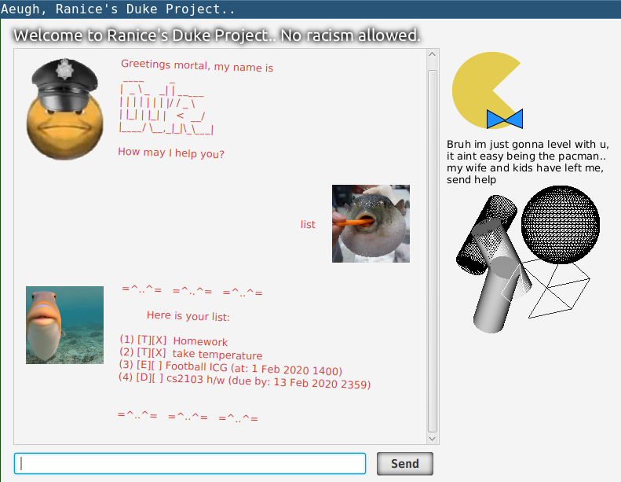

 

# User Guide
This guide covers the features and usage of the **Aeugh, Ranice's Duke Project...** application.

## Overview
1. [Purpose](#purpose)
2. [Features](#features)
3. [Usage](#usage)
   1. [Adding Tasks](#adding-tasks)
      1. [`todo`](#todo---adds-to-do-task-into-task-list)
      2. [`deadline`](#deadline---adds-deadline-task-into-task-list)
      3. [`event`](#event---adds-event-task-into-task-list)
   2. [Task List Manipulation](#task-list-manipulation)
      1. [`list`](#list---prints-out-entire-task-list)
      2. [`find`](#find---helps-to-search-for-a-task-in-the-task-list-given-keywords)
      3. [`done`](#done---marks-a-task-as-done-in-the-task-list)
      4. [`delete`](#delete---deletes-a-task-from-the-task-list)

## Purpose
**Aeugh, Ranice's Duke Project...** is a simple task managing application. It features a simple Graphical User Interface (GUI) and Command Line Interface (CLI) for user input.
 
 

This application was developed for the CS2103T Software Engineering individual project assignment in AY19/20.

## Features 

+ ### Task Types: To Dos, Deadlines, and Events

   There are 3 different types of tasks that can recorded by the task list: To Dos, Deadlines, and Events. All tasks are labelled with a task name. 

  1. **To Dos** : Regular task with no additional metadata.
  2. **Deadlines** : To keep track of deadlines, consists of due date and time metadata. 
  3. **Events** : To keep track of events, consists of event occurance data and time metadata.

+ ### Task List 

   This application has an in bult task list that keeps track of all tasks and their metadata. Each task is assigned an index number dependant on the time at which the task was added into the list, in ascending order. The task list also keeps track of the status of each task, if the task has been completed or not. Tasks can be mark as done, as well as removed from the list. The task list can be printed out into the GUI for user viewing, and the task list features a simple search function to search for tasks in the list.
   
+ ### Data Saving 

   When first using this application, a data file named `duke.txt` will be created alongside the executable, for storing data. If the file already exists within the working directory, the program will read the existing `duke.txt` file. 

   Data of the task list is written into `duke.txt` to be loaded into the application in every session. At the end of the session, all changes to the task list will be written back to `duke.txt` for use in subsequent sessions.

## Usage

This application is used through a command line interface. You are required to enter commands into a text box to add tasks and manipulate the task list. 

Entered commands will be echoed into the chat box, afterwhich, the application will output the outcome of your command. 

### Adding Tasks

+ #### `todo` - Adds 'To Do' task into task list.

  This command adds a 'To Do' type task into the task list.  
  It has 1 parameter, `TASK_NAME`, for the name of the task.

  Example of Usage: 
  
  |Syntax|Example|
  |------|-------|
  |`todo TASK_NAME`| `todo homework`|
  
  Example of Outcome:

  The program will confirm the addition of the task and echo the details of the added task in the chat box. 
  It will also output the resultant number of tasks in your task list.
   
   
  
  
+ #### `deadline` - Adds 'Deadline' task into task list.

  This command adds a 'Deadline' type task into the task list.  
  It has 3 parameters, `TASK_NAME`, for the name of the task, `DATE` and `TIME` for the deadline.

  Example of Usage: 
  
  |Syntax|Example|
  |------|-------|
  |`deadline TASK_NAME` **`/by`** `DATE TIME`|`deadline assignment` **`/by`** `2020-02-01 2359`||

  > &#10071; **Important to Note**  
  > Please enter the date and time in the `YYYY-MM-DD HHMM` format.
  
  Example of Outcome:
  
  The program will confirm the addition of the task and echo the details of the added task in the chat box. 
  It will also output the resultant number of tasks in your task list. 
   
  
  

+ #### `event` - Adds 'Event' task into task list.

  This command adds an 'Event' type task into the task list.  
  It has 3 parameters, `TASK_NAME`, for the name of the task, `DATE` and `TIME` of the event.
  
  Example of Usage: 

  |Syntax|Example|
  |------|-------|
  |`event TASK_NAME` **`/at`** `DATE TIME`|`event formal dinner` **`/at`** `2020-02-01 2359`|
    
  > &#10071; **Important to Note**  
  > Please enter the date and time in the `YYYY-MM-DD HHMM` format.

  Example of Outcome:

  The program will confirm the addition of the task and echo the details of the added task in the chat box.  
  It will also output the resultant number of tasks in your task list. 
   
  

### Task List Manipulation

+ #### `list` - Prints out entire task list.

  This command helps to display entire task list for user viewing in the GUI.

  Example of Usage:

  |Syntax|Example|
  |------|-------|
  |`list`|`list`|
  
  Example of Outcome:

  The program will print out the entire task list into the chat box, including the index and status of the task. 
   
  

+ #### `find` - Helps to search for a task in the task list given keywords.

  This command helps to search for a task in the task list given a singular keyword.  
  The tasks are searched by their task names, and any task with a task name containing the specified keyword, will be listed out in the GUI for user viewing. 
  The search is case sensitive.

  Example of Usage:

  |Syntax|Example|
  |------|-------|
  |`find [KEYWORD]`|`find dinner`|
  
  Example of Outcome:
  
  The program will print out a list of results containing tasks with tasknames containing the `keyword` substring. 
   
  
  
+ #### `done` - Marks a task as 'done' in the task list.

  This command helps to mark a task as 'done' in the task list, given the `INDEX` of the task to be marked as 'done'.

  Example of Usage:

  |Syntax|Example|
  |------|-------|
  |`done INDEX`|`done 1`|
  
  > &#10071; **Important to Note**  
  > Please enter an index that is within the number of items in the task list.
  
  Example of Outcome:

  The program will confirm the completion of the task and echo the details of the task. 
  Previously incomplete tasks will have a change in status from `[ ]` to `[X]`.  
   
  

+ #### `delete` - Deletes a task from the task list.

  This command helps to delete tasks from the task list, given the `INDEX` of the task to be deleted.

  Example of Usage:

  |Syntax|Example|
  |------|-------|
  |`delete INDEX`|`delete 1`|
  
  > &#10071; **Important to Note**  
  > Please enter an index that is within the number of items in the task list.

  Example of Outcome:

  The program will confirm the deletion of the task and echo the details of the deleted task. 
   
  
  
### Exiting the Program

There are 2 ways to exit this program. 
1. Exiting through clicking the 'close' button on the window titlebar.
2. Using the `bye` command.

+ #### `bye` - Exits and closes the program

  This command helps to delete tasks from the task list, given the `INDEX` of the task to be deleted.

  Example of Usage:

  |Syntax|Example|
  |------|-------|
  |`bye`|`bye`|
  
  Example of Outcome:

  Program will close and the window will disappear.

